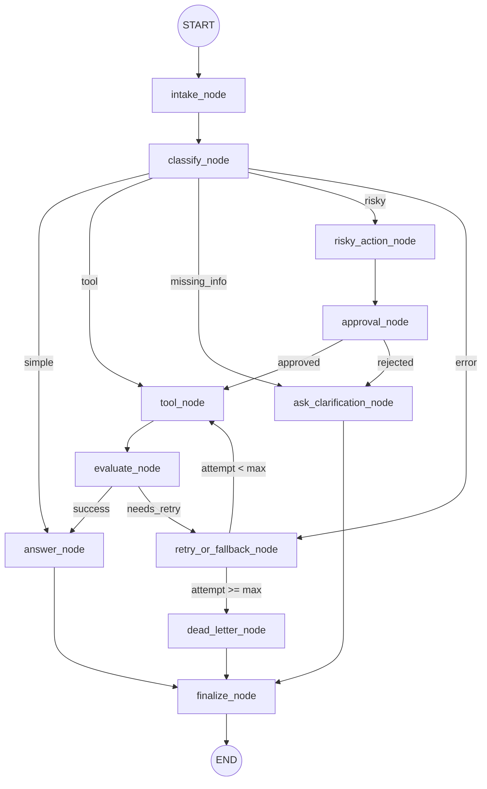

# Day 08 Lab Presentation: LangGraph Agentic Orchestration

---

## 1. Project Overview & Objectives

* **Goal:** Build a production-grade LangGraph agentic workflow for support ticket automation.
* **Orchestration:** Coordinate intent classification, tool execution, quality evaluation, retry loops, human approval, and escalation.
* **Key Metrics:** Achieved **100% success rate** across all 7 evaluation scenarios.
* **Grade band:** Aiming for **90+ (Production Quality)** with SQLite Checkpointing & Multi-provider LLM Fallback.

---

## 2. Agent Architecture

The workflow consists of **11 stateful nodes** wired with conditional routing edges:

---

## 3. Lean & Typed State Schema

We use `AgentState` (`TypedDict`) containing two types of fields:

### Current Status (Overwrite)
* `route`: Classified intent (`simple`, `tool`, `missing_info`, `risky`, `error`)
* `attempt` & `max_attempts`: Track retry execution
* `final_answer` & `pending_question`: Final outputs
* `evaluation_result`: Retry loop gate ("success" / "needs_retry")
* `proposed_action` & `approval`: HITL state

### Full Audit Trail (Append-Only using `add` reducer)
* `messages`: Audit log of conversational states
* `tool_results`: Historic data fetched from external tools
* `errors`: Collected exception logs
* `events`: Step-by-step workflow tracer

---

## 4. LLM Intent Classification

* **Structured Output:** Powered by Pydantic schema `IntentClassification` with strict prioritization:
  $$\text{risky} > \text{tool} > \text{missing\_info} > \text{error} > \text{simple}$$
* **Prompt Engineering:** Standardized prompt containing context definitions, priority rules, and distinct examples.
* **Fallback Strategy:** Automatically switches from structured output to raw generation and down to default classification if API errors occur.
* **LLM Engine:** Run via **DeepSeek / Mistral** endpoints when Gemini free tier quota is exhausted.

---

## 5. Bounded Retry Loops

Transient tool failures are managed in a three-stage sequence:
$$\text{Retry} \longrightarrow \text{Fallback} \longrightarrow \text{Dead Letter}$$

1. **Heuristic Evaluation:** `evaluate_node` flags results containing `"ERROR"` as `needs_retry`.
2. **Loop Iteration:** Routes through `retry_or_fallback_node` to increment `attempt`.
3. **Loop Boundary:** `route_after_retry` checks if `attempt < max_attempts`:
   * If yes: Retries the tool.
   * If no: Escalates to `dead_letter_node` for manual customer support review.
* **Verification:** S07 (`max_attempts=1`) immediately escalates to dead-letter without infinite loops.

---

## 6. Human-In-The-Loop (HITL)

* **Design Pattern:** Critical operations (deletions, refunds) must route to `risky_action_node` to stage the action before requesting approval.
* **Mock Approval:** Defaults to `approved=True` for test execution and offline automated grading.
* **Production Ready:** Checking `LANGGRAPH_INTERRUPT=true` triggers `interrupt()` to hold the thread state and wait for external input.
* **Rejection Workflow:** If approval is rejected, the graph redirects to the clarification node to inform the customer and ask for alternatives.

---

## 7. Persistence & Recovery

* **Checkpointing:** State saved automatically at every node boundary.
* **Thread Isolation:** Each scenario runs under a unique `thread_id` (e.g., `thread-S01_simple`) to isolate user sessions.
* **Durable Storage:** Implemented **SQLite checkpointer** (`SqliteSaver`) in WAL (Write-Ahead Logging) journal mode.
* **Durable Recovery:** Survives process termination, allowing full resume from the last known state using the thread's checkpoint.

---

## 8. Scenario Results (100.0% Success)

Our agent successfully resolved all 7 sample scenarios:

| Scenario | Expected Route | Actual Route | Success | Retries | Interrupts |
|---|---|---|---:|---:|---:|
| **S01_simple** | simple | simple | ✅ | 0 | 0 |
| **S02_tool** | tool | tool | ✅ | 0 | 0 |
| **S03_missing** | missing_info | missing_info | ✅ | 0 | 0 |
| **S04_risky** | risky | risky | ✅ | 0 | 1 |
| **S05_error** | error | error | ✅ | 2 | 0 |
| **S06_delete** | risky | risky | ✅ | 0 | 1 |
| **S07_dead_letter** | error | error | ✅ | 1 | 0 |

---

## 9. Extensions & Future Improvement

### Implemented Extensions (90+ Band)
1. **SQLite Checkpointing:** WAL-mode SQLite database adapter.
2. **Real HITL support:** Uses `interrupt()` to block execution waiting for human verification.
3. **Multi-provider Fallback:** Factory falls back across Gemini, DeepSeek, and Mistral.

### Future Roadmap
1. **LLM-As-Judge:** Replace simple string-matching evaluation with an LLM evaluator.
2. **Parallel Fan-out:** Execute concurrent tool calls using LangGraph's `Send()` command.
3. **Observability:** Integrate LangSmith tracing for visual workflow performance analysis.
